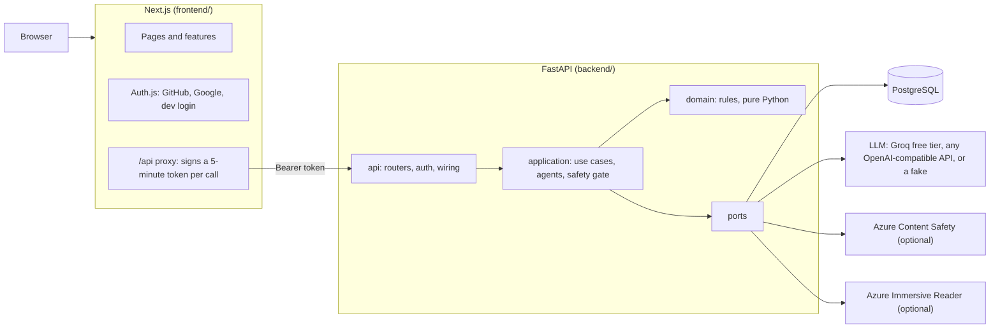

<div align="center">

# 🐾 Pebble

**A calm assistant for neurodivergent people, with an animated CSS cat beside you**

Pebble helps people with ADHD, autism or dyslexia break tasks into small steps, read documents at a level that suits them, and focus, without guilt, streaks or pressure.

[](https://github.com/Eufanzky/pebble/actions/workflows/ci.yml)
[](https://nextjs.org/)
[](https://react.dev/)
[](https://fastapi.tiangolo.com/)
[](https://www.postgresql.org/)

</div>

> The original hackathon submission, with its slides and prototype, is the [`v0.1.0-hackathon` release](https://github.com/Eufanzky/pebble/releases/tag/v0.1.0-hackathon). Everything since is the rework planned in [`specs/`](specs/roadmap.md).

---

## ✨ What it does

**Today.** Your list, with what's up next and a "Mark as done" button. Tasks have a tag, an estimate and a priority. You can edit, delete, reorder (drag or keyboard), search and filter them. "Break it down" asks CalmSense to split any task into small, time-boxed steps of your step size, and a "Why?" card shows its reasoning. "Add to calendar" saves the steps as a calendar file, back to back from the next quarter hour. A roadmap view shows the same list as a path. Typing something like "I'm overwhelmed" gets gentle support instead of a new task.

**Chat with Pebble.** An orchestrator works out what you need and routes it: a breakdown (CalmSense), a simpler version of a text (SimplifyCore), or specific encouragement (PebbleVoice). Distress is answered at once, without a sub-agent. A breakdown in chat can go straight onto Today.

**Documents.** Upload a PDF, Word or text file (read in memory, never stored), choose a reading level from 1 to 10, and SimplifyCore rewrites it at that level, beside the original. It says when only the first part of a long document was simplified, and when its version may say things the original doesn't. Its action items can go onto Today, one by one or as a study plan. The example documents also have a comprehension check. A built-in reader (read aloud, syllables, line focus) works without any setup; Azure Immersive Reader is used when it's configured.

**Focus.** A 25-minute timer with Pebble beside you. Pause or stop whenever you need to; the minutes count towards your stats.

**Stats.** Steps, tasks and focus minutes over the last 7 or 30 days, per day and per tag, and since you started. Progress only adds up: there are no streaks, no "missed" days and no comparisons, and unticking a task never takes anything back.

**Activity log.** Every agent result, with the agent's name, WhyBot's plain-language explanation, the agent's own reasoning, and whether the safety checks passed. A message the checks hold back is logged too, without its text. Only what an agent did is logged in its name, and only the backend writes it.

**AdaptLens.** When a pattern shows in what you do (documents read at one level, steps you skip), Today shows one suggestion, such as "Make level 3 your default?", with what it noticed. Nothing changes unless you accept, and "Not now" keeps it away for two weeks.

**Pebble.** Seven cat models built only from CSS shapes, five colours, three personalities, and moods that follow your day.

**Your account.** Sign in with GitHub or Google. Your list, settings, log and progress are saved to your account. You can download everything as JSON or delete your account in Settings.

**For everyone.** Reduce motion (it also follows your system setting), calm mode (no emoji), a reading level and step size that suit you, full keyboard use, and axe checks on every page. It works on any screen: a bottom tab bar on phones and a sidebar on wider screens. You can install it as an app, and it shows a calm page when you're offline.

---

## 🏗️ How it fits together



- **Frontend** (`frontend/`): Next.js 16, React 19, TypeScript, Tailwind 4, TanStack Query. Code is organised by feature (`src/features/<name>/`), with shared pieces and the design system in `src/shared/`.
- **Backend** (`backend/`): FastAPI on Python 3.12+, in a clean architecture (domain, application, infrastructure, api). Every external service sits behind a port, so it can be swapped or faked.
- **Sign-in:** Auth.js runs in Next.js. The browser never talks to FastAPI directly. The Next.js server forwards each `/api` call with a short-lived token that FastAPI checks.
- **Safety:** every message goes through Prompt Shields and Content Safety (when configured) and PII redaction before any model sees it, and every reply is checked again. Redaction always runs.

### Agents

| Agent | Does | Status |
|:--|:--|:--|
| 🧠 Orchestrator | Works out the intent and routes the message | Working |
| 🧩 CalmSense | Breaks a task into small, time-boxed steps | Working |
| 📖 SimplifyCore | Rewrites text at your reading level, pulls out action items | Working |
| 💬 PebbleVoice | Specific encouragement, never generic praise | Working |
| ❓ WhyBot | A plain-language "why" for every agent result | Working |
| 🔄 AdaptLens | Suggests preference changes from how you use Pebble, applied only when you accept | Working |
| 🔗 BridgeBot | Puts a task's steps in a calendar file for Google Calendar, Outlook or any calendar app | Working (Google Calendar sync: [7.8](specs/roadmap.md)) |

The default model is `openai/gpt-oss-120b` on Groq's free tier: no card, and no prompts kept by default. `LLM_PROVIDER=fake` runs everything offline with scripted replies.

---

## 🚀 Run it locally

You need Node.js 22.13+, [uv](https://docs.astral.sh/uv/getting-started/installation/) (it installs Python 3.12 for you), and Docker for Postgres (or any Postgres 17 with the same role and databases).

```bash
docker compose up -d db                                    # Postgres
cd backend && uv sync && cp .env.example .env              # then set LLM_API_KEY (or LLM_PROVIDER=fake) and AUTH_TOKEN_SECRET
uv run alembic upgrade head && uv run uvicorn app.main:app --port 8000 --reload
cd ../pebble && npm install && cp .env.example .env.local   # then set AUTH_SECRET and the same AUTH_TOKEN_SECRET
npm run dev                                                 # http://localhost:3000, sign in with the dev login
```

Make the two secrets with `openssl rand -base64 32`. `AUTH_TOKEN_SECRET` must be the same in both `.env` files, because the Next.js server signs every API call with it. GitHub and Google sign-in appear once their OAuth apps are set in `frontend/.env.local`; the dev login (`AUTH_DEV_LOGIN=true`) works without them. Swagger is at http://localhost:8000/docs.

Without a database the backend still starts, and the endpoints that save things answer 503. Without an LLM key, the agents answer 503.

---

## 🧪 Tests and checks

Every change ships with tests ([`specs/testing.md`](specs/testing.md)), and CI runs all of these on every pull request.

| Where | Command | What |
|:--|:--|:--|
| `frontend/` | `npm test` | Vitest: units, components, axe, the guilt scan, design-token and docs-link checks |
| `frontend/` | `npm run test:coverage` | The same, with an 80% floor on feature logic and hooks |
| `frontend/` | `npm run lint` · `npm run lint:dead` | ESLint (with feature import boundaries) · knip (unused files, exports and dependencies) |
| `frontend/` | `npm run test:e2e` | Playwright against the real backend (fake LLM) and Postgres: the demo flow, every page at three widths with axe, installability, offline |
| `backend/` | `uv run pytest` | Domain, use cases, API, adapter contracts; add `TEST_DATABASE_URL` for the Postgres integration tests |
| `backend/` | `uv run ruff check` · `uv run vulture` | Lint · dead code |
| `backend/` | `uv run pytest -m eval` | Real-LLM evals (weekly in CI; needs `LLM_API_KEY`) |

The guilt scan fails on streaks, "overdue", missed days, loss framing or alarm colours anywhere in the app's copy and prompts.

---

## 📁 Where things are

```
frontend/                Frontend (Next.js)
  src/app/               Routes only, plus the app shell, the /api proxy, icons and manifest
  src/features/          tasks, documents, chat, companion, activity, settings, focus, stats, auth
  src/shared/            Design system (ui/), API client, hooks, preferences
  src/test/              Test setup, MSW fakes of the API, render helpers
  e2e/                   Playwright
backend/                 Backend (FastAPI)
  app/domain/            Rules, pure Python
  app/application/       Use cases, agents, ports, prompts
  app/infrastructure/    Adapters: LLM, safety, parsing, Postgres
  app/api/               Routers, schemas, auth, wiring
  migrations/            Alembic
  tests/                 unit, api, contract, integration, evals
specs/                   Mission, tech stack, testing rules, roadmap, audit
  changes/               One folder per change: requirements, plan, validation
docker-compose.yml       Local Postgres
docker/postgres-init/    Creates the test databases when that Postgres first starts
```

More detail: [`backend/README.md`](backend/README.md) (every endpoint, the agents, safety, the database) and [`CLAUDE.md`](CLAUDE.md) (how the code is put together, for contributors and coding agents).

---

## 🎨 Principles

From [`specs/mission.md`](specs/mission.md):

- **Structure without guilt.** Visible time, progress that only adds up, offers to make a task smaller. Never streaks, missed-day counts, red alarms or "overdue".
- **Every AI action is explainable.** The activity log names the agent, its reasoning and the safety result.
- **Privacy first.** PII is redacted before any model call; documents aren't stored; you can export or delete everything.
- **Calm by design.** Dark only, soft motion that stops when you ask, and Pebble drawn in CSS.
- **Honest.** No fake people, numbers or features: what the README claims, the tests check.

---

## 📄 License

[MIT](LICENSE)
